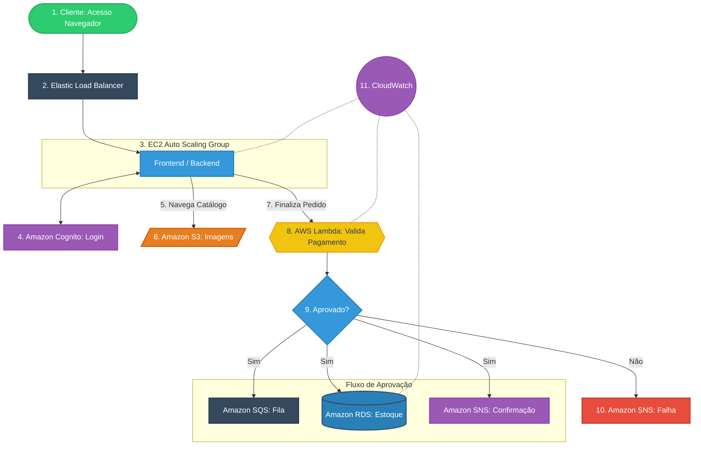

# 🏥 Abstergo Cloud Commerce – Arquitetura AWS para E-commerce Farmacêutico

> Projeto desenvolvido como parte do desafio do bootcamp  
> **Santander 2025 – Ciência de Dados com Python**, promovido pela **DIO em parceria com o Banco Santander**.

---

---

## 📌 Sobre o Projeto

Este projeto apresenta a proposta de implementação de uma **arquitetura AWS para um e-commerce farmacêutico**, desenvolvido para a empresa fictícia **Abstergo**, empresa esta, que quer começar a atuar com a redistribuição de produtos farmacêuticos para farmácias da região.

O objetivo é demonstrar, de forma prática e aplicada, como a computação em nuvem pode reduzir custos, aumentar a escalabilidade e garantir maior segurança e disponibilidade da aplicação.

---

## 🎯 Objetivo do Desafio

Implementar uma solução em nuvem utilizando serviços da AWS para uma empresa do setor farmacêutico, com foco em:

- Redução de custos operacionais  
- Escalabilidade automática  
- Alta disponibilidade  
- Segurança da informação  
- Processamento eficiente de pedidos  

---

# RELATÓRIO DE IMPLEMENTAÇÃO DE SERVIÇOS AWS

Data: 07/12/2025  
Empresa: Abstergo Industries  
Responsável: Lucas Pimenta  

---

## Introdução

Este relatório apresenta o processo de implementação de ferramentas na empresa Abstergo Industries, realizado por Lucas Pimenta. O objetivo do projeto foi selecionar e aplicar serviços da AWS com foco principal na redução imediata de custos operacionais, escalabilidade automática da aplicação e modernização da infraestrutura, considerando um cenário de e-commerce voltado para a distribuição de produtos farmacêuticos.

Embora a atividade solicite o uso de três serviços principais, a arquitetura proposta utiliza serviços complementares essenciais para garantir segurança, processamento assíncrono, autenticação e monitoramento da aplicação.

---

## Descrição do Projeto

### Etapa 1:
- **Nome da ferramenta:** Amazon EC2 com Auto Scaling  
- **Foco da ferramenta:** Hospedagem da aplicação e escalabilidade automática  
- **Descrição de caso de uso:**  
  O Amazon EC2 é utilizado para hospedar o frontend e o backend da aplicação da Abstergo, ambos executados em contêineres Docker. O Auto Scaling permite que novas instâncias sejam criadas automaticamente conforme o aumento da demanda. O tráfego é distribuído por meio do Elastic Load Balancer (ELB), garantindo alta disponibilidade.

---

### Etapa 2:
- **Nome da ferramenta:** Amazon RDS  
- **Foco da ferramenta:** Banco de dados relacional gerenciado  
- **Descrição de caso de uso:**  
  O Amazon RDS armazena os dados de clientes, pedidos e estoque. O serviço gerencia backups, atualizações e falhas automaticamente, aumentando a confiabilidade e reduzindo custos operacionais.

---

### Etapa 3:
- **Nome da ferramenta:** Amazon S3  
- **Foco da ferramenta:** Armazenamento de arquivos estáticos  
- **Descrição de caso de uso:**  
  O Amazon S3 é utilizado para armazenar as imagens dos produtos, reduzindo o consumo de processamento nas instâncias EC2 e garantindo alta durabilidade com baixo custo.

---

## Serviços AWS Utilizados

- Amazon EC2  
- Auto Scaling  
- Elastic Load Balancer (ELB)  
- Amazon RDS  
- Amazon S3  
- Amazon Cognito  
- AWS Lambda  
- Amazon SQS  
- Amazon SNS  
- Amazon CloudWatch  

---

## 🔄 Fluxo de Funcionamento da Aplicação

1. O cliente acessa o site da Abstergo pelo navegador.  

2. A requisição passa inicialmente pelo **Elastic Load Balancer (ELB)**.  

3. O ELB direciona o acesso para uma **instância Amazon EC2 em Auto Scaling**, onde estão:
   - O frontend da aplicação  
   - O backend da aplicação  
   - Containers Docker  

4. O cliente realiza login ou cadastro por meio do **Amazon Cognito**.  

5. Após autenticado, o cliente navega pelo catálogo de produtos.  

6. As imagens dos produtos são carregadas a partir do **Amazon S3**.  

7. O cliente adiciona os produtos ao carrinho e clica em **"Pagar"**.  

8. **Validação do Pagamento com AWS Lambda (Fluxo Detalhado):**
   - O cliente clica em **"Pagar"** e o site envia os dados do cartão de forma criptografada.  
   - A instância **EC2 chama a função AWS Lambda**, solicitando a validação do pagamento.  
   - A **Lambda se conecta a uma API externa de pagamento** (como Cielo ou Stripe) e consulta se há saldo disponível.  
   - A API retorna uma resposta (**Sim ou Não**).  
   - A Lambda devolve essa resposta para o fluxo da aplicação:  
     - Se for **"Sim"**, o fluxo segue normalmente para o SQS.  
     - Se for **"Não"**, o fluxo é direcionado para o SNS para notificação ao cliente.  

9. Se o pagamento for aprovado:
   - O pedido é enviado para o **Amazon SQS**.  
   - O **Amazon RDS atualiza o estoque e registra o pedido**.  
   - O **Amazon SNS envia a confirmação ao cliente**.  

10. Se o pagamento for reprovado:
   - O **Amazon SNS envia uma notificação informando a falha**.  

11. Toda a aplicação é monitorada por meio do **Amazon CloudWatch**.

---

## 🗺️ Diagrama da Arquitetura

Abaixo, o diagrama visualiza a interação entre os componentes descritos nos passos 1 a 11:

## Conclusão

A implementação da arquitetura em nuvem para a Abstergo Industries proporciona redução de custos, aumento da escalabilidade, maior segurança e melhor desempenho da aplicação. A solução está preparada para crescimento e atende com eficiência um cenário real de e-commerce farmacêutico.

---

## 👨‍💻 Autor

**Lucas Pimenta**  
Bootcamp Santander 2025 – Ciência de Dados com Python  
DIO + Banco Santander  

